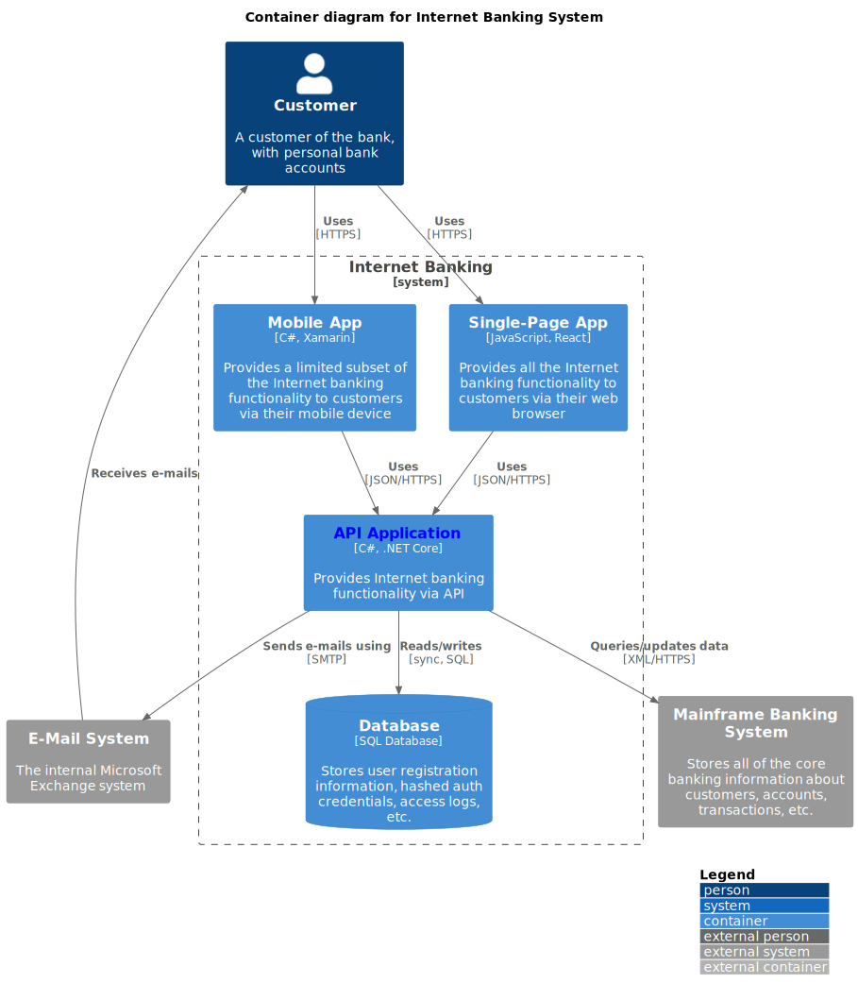

# Architecture Documentation Demo

This repository is the practical companion to [this blog post]() demonstrating the techniques discussed.

## Credits

This demo uses Simon Brown's [C4 architecture model](https://c4model.com/), including an adaptation of his online banking example.

The Plant UML diagrams are reused and adapted from the C4 Plant UML plugin, available at [https://github.com/plantuml-stdlib/C4-PlantUML](https://github.com/plantuml-stdlib/C4-PlantUML).

## Internet Banking System

### C4 Context

### C4 Container

